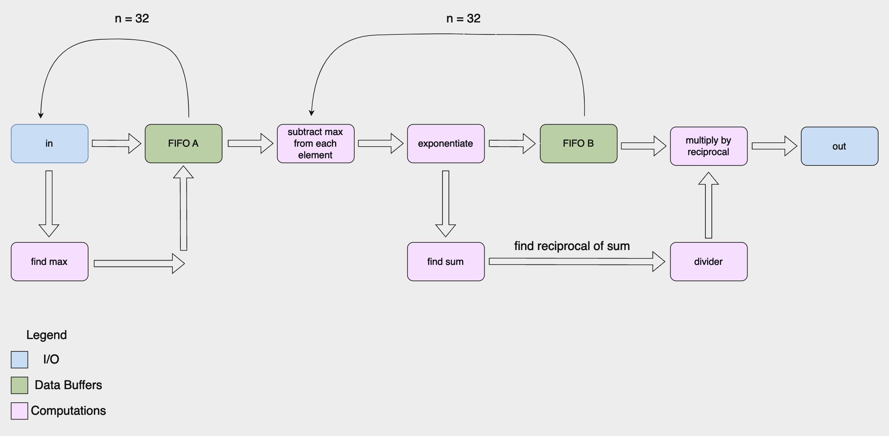

# Softmax Accelerator



This is a pipelined softmax module that can be used in any ML application (i.e. transformers). I followed the approach used in the [I-BERT paper](https://arxiv.org/abs/2101.01321) to compute softmax on int8 values, which proved to be a lot more challenging than using fixed point or floating point numbers. I took on this challenge to learn more about how non-linear functions are computed in hardware. You can find my learnings and how I implemented this in my [article](https://decompose.substack.com/p/decomposing-softmax-for-hardware).

To test a module, install Icarus Verilog and GTKWave and run:

```
make test_[MODULE_NAME]
```

View the waveform by running:

```
gtkwave waveforms/[MODULE_NAME].vcd
```
